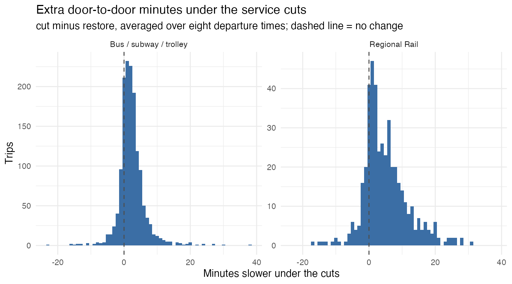
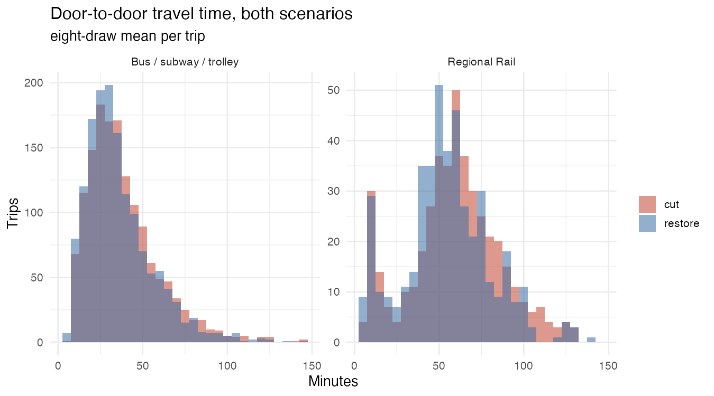
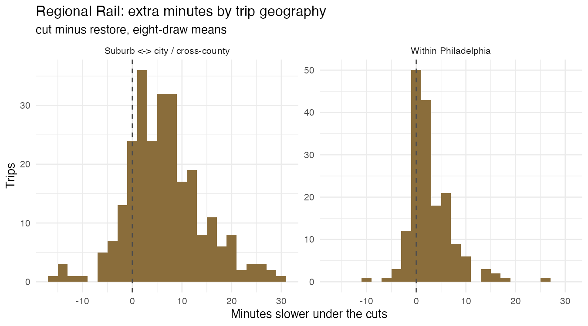
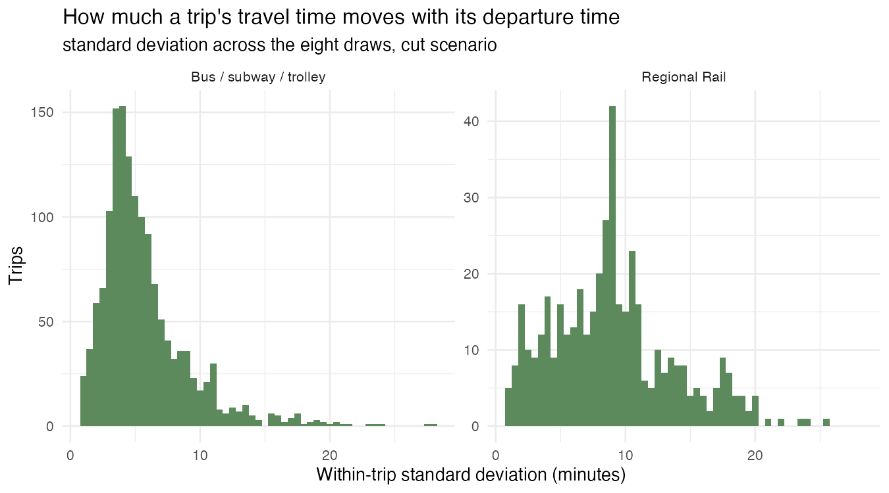

# SEPTA service cuts: estimated travel time effects

Draft, exploratory. Travel times for DVRPC household-survey trips routed through
SEPTA's service-cut and restored GTFS feeds.

## What was estimated

Each surveyed trip is routed on its own, door to door, departing at the time the
respondent reported: walk to a stop, wait, ride (transfers included), walk from
the final stop to the destination. Origins and destinations are TAZ centroids.

Every trip is routed **eight times**, at departures spanning the reported time
±30 minutes, and the eight results are averaged. The spacing is 8.5 minutes,
chosen because SEPTA headways cluster on 10, 12 and 15 minutes: a spacing that
divided into those would keep landing on the same point in the headway cycle and
all eight draws would inherit the same wait. The 59.5-minute span avoids the same
trap for the first and last draw.

Two samples, kept separate because they run on different feeds:

| Sample | Trips routed | Feed | Service date |
|---|---|---|---|
| Bus / subway / trolley | 1,473 | City Transit | 2025-10-15 |
| Regional Rail | 442 | City Transit + Regional Rail | 2025-11-05 |

The dates differ because the restored rail feed's weekday service only begins
2025-10-26. Both bus feeds operate identical trip counts on the two dates
(11,792 under the cuts, 15,102 restored), so the samples remain comparable.

Rail trips are the 501 records that involve Regional Rail — 479 rail legs plus 22
bus or subway legs feeding a station, identified by chaining trips across activity
code 19, "change type of transportation." Of those, 442 route under both scenarios.

## Results

### The cuts cost Regional Rail riders about twice what they cost bus riders

| Sample | n | Cut | Restore | Median diff | Mean diff | Diff as % of restore time |
|---|---|---|---|---|---|---|
| Bus / subway / trolley | 1,473 | 33.7 | 31.7 | +1.86 | +2.26 | 7.1% |
| **Regional Rail** | **442** | **60.0** | **54.0** | **+3.73** | **+4.97** | **9.2%** |

All figures in minutes. Rail loses more in absolute terms and as a share of trip
time, on top of rail trips already being nearly twice as long.

### Suburban commuters absorb the loss

| Geography | n | Cut | Restore | Median diff | Mean diff |
|---|---|---|---|---|---|
| **Suburb ↔ city / cross-county** | 259 | 68.8 | 62.2 | **+5.98** | **+6.54** |
| Within Philadelphia | 171 | 46.6 | 42.8 | +1.79 | +2.85 |
| Within one suburban county | 12 | 37.3 | 37.2 | +1.69 | +1.39 |

Cross-county rail trips lose six minutes or more each. Rail trips that stay inside
Philadelphia have bus and subway alternatives, and their loss looks like the bus
sample's.

### Rail and bus are hit in opposite time periods

| Period | n | Cut | Restore | Median diff |
|---|---|---|---|---|
| **AM peak** | 183 | 61.6 | 55.3 | **+5.37** |
| PM peak | 154 | 57.9 | 51.1 | +3.08 |
| Off-peak | 105 | 60.3 | 55.4 | +2.29 |

Regional Rail, above. The bus sample runs the other way: off-peak is worst there
(+2.05 median) and AM peak mildest (+1.62). The rail pattern matches how rail
service was reduced — weekday trains fall from 625 to 461, concentrated in
commuting hours — while bus cuts thin midday headways first.

### The averages hide the tail

Rail deltas: 5th percentile −3.3, median +3.7, 75th +8.3, 90th +13.6, 95th +17.9.
**82 rail trips lose more than 10 minutes and 17 lose more than 20.** Losses that
size come from routes disappearing, not from schedules being retimed.

### Departure timing moves a trip more than the cuts do

The eight draws for a single trip have a median standard deviation of 4.8 minutes
(bus) and 8.8 minutes (rail), against scenario differences of 2.3 and 5.0. For an
individual rider, when you leave matters as much as or more than whether the cuts
happened; the cut effect only emerges on aggregate. This is also why averaging
eight departures mattered: on a single draw the bus median difference was 1.00
minute with a standard deviation of 8.46, against 1.86 and 4.21 after averaging.

## Caveats

**The two feeds are not a matched pair.** They are separately published
timetables, not one network with service removed: 60 stops are served only under
the cut feed, 302 see more departures under it, and 65% of the cut feed's
departure events have no exact counterpart in the restored feed. About 17% of rail
trips and 19% of bus trips come out faster under the cuts, which is the visible
symptom. Read the results as a comparison of two operating plans as SEPTA ran
them, not as an isolated causal effect of the cuts.

**Estimates run high against the survey.** For rail legs the restored-scenario
median is 54.7 minutes against 38 reported and 37.8 from `Model_TravTime`, about
45% higher. The estimates are door to door and include access walking and waiting,
which the other two largely exclude, and suburban TAZ centroids sit farther from
stations than real addresses do. Rank correlation with `Model_TravTime` is 0.879,
so relative comparisons hold even though levels are inflated.

**The trips are legs, not journeys.** About a quarter of records end at a transfer,
so their estimated time is time-to-transfer-point rather than to a final
destination.

**This is a counterfactual.** 2012–13 origins, destinations and departure times are
projected onto 2025 networks.

## Files

| File | Contents |
|---|---|
| `data/transit_simple_estimates.csv` | 1,536 bus trips with both scenarios |
| `data/transit_regional_rail_estimates.csv` | 501 rail trips with both scenarios |
| `data/transit_traveltime_sampled_*.csv` | all eight draws per trip |
| `figures/` | the histograms above |

Scripts: `pre-process.R` builds the trip table, `extract-regional-rail.R` pulls the
rail sample, `merge-gtfs.R` joins bus and rail feeds, `estimate-traveltime.R` does
the routing, `join-results.R` assembles the output tables, `make-figures.R` draws
the histograms.
