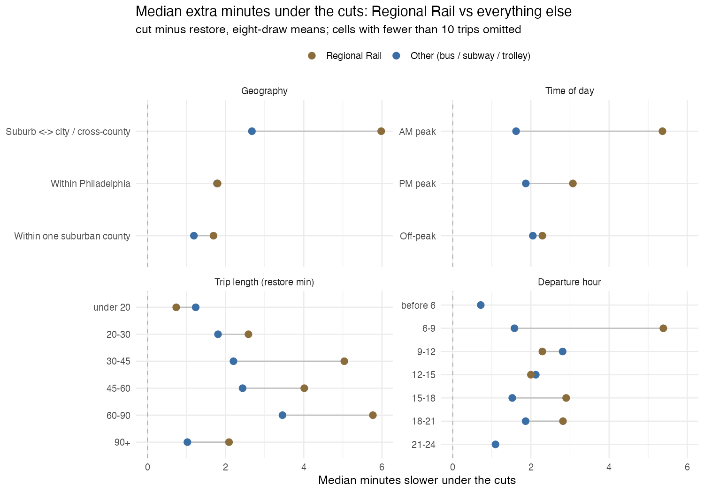

# SEPTA service cuts: estimated travel time effects

Draft, exploratory. Travel times for DVRPC household-survey trips routed through
SEPTA's service-cut and restored GTFS feeds.

## What was estimated

Each surveyed trip is routed on its own, door to door, departing at the time the
respondent reported: walk to a stop, wait, ride (transfers included), walk from
the final stop to the destination. Origins and destinations are TAZ centroids.

Every trip is routed **eight times**, at departures spanning the reported time
±30 minutes, and the eight results are averaged. The spacing is 8.5 minutes,
chosen because SEPTA headways cluster on 10, 12 and 15 minutes: a spacing that
divided into those would keep landing on the same point in the headway cycle and
all eight draws would inherit the same wait. The 59.5-minute span avoids the same
trap for the first and last draw.

Two samples, kept separate because they run on different feeds:

| Sample | Trips routed | Feed | Service date |
|---|---|---|---|
| Bus / subway / trolley | 1,473 | City Transit | 2025-10-15 |
| Regional Rail | 442 | City Transit + Regional Rail | 2025-11-05 |

The dates differ because the restored rail feed's weekday service only begins
2025-10-26. Both bus feeds operate identical trip counts on the two dates
(11,792 under the cuts, 15,102 restored), so the samples remain comparable.

Rail trips are the 501 records that involve Regional Rail — 479 rail legs plus 22
bus or subway legs feeding a station, identified by chaining trips across activity
code 19, "change type of transportation." Of those, 442 route under both scenarios.

## Results

Everything below is the same quantity — **delta = cut minus restore**, on the
eight-draw means, one value per trip — sliced different ways, with Regional Rail
and the non-rail sample side by side in every table. Positive means slower under
the cuts. `compare-rail-vs-bus.R` regenerates all eleven tables into
`tables/rail-vs-other.md`; they are reproduced here with the reading.

### Rail loses roughly twice what everything else loses

#### Table A. Regional Rail vs everything else, side by side

| Measure | Regional Rail | Other (bus / subway / trolley) | Rail minus other |
|---|---|---|---|
| Trips routed under both | 442 | 1,473 | -- |
| Median time, cut | 60.0 | 33.7 | +26.36 |
| Median time, restore | 54.0 | 31.7 | +22.34 |
| Median delta | +3.73 | +1.86 | +1.86 |
| Mean delta | +4.97 | +2.26 | +2.71 |
| Median delta, % of restore time | +8.1% | +6.3% | +1.7 pp |
| 75th pct delta | +8.26 | +3.75 | +4.51 |
| 90th pct delta | +13.62 | +6.27 | +7.36 |
| Share > 5 min slower | 43% | 15% | +28 pp |
| Share > 10 min slower | 19% | 4% | +15 pp |
| Share > 20 min slower | 4% | 1% | +3 pp |
| Share faster by > 1 min under cuts | 12% | 11% | +1 pp |
| Share faster at all under cuts | 18% | 20% | -2 pp |
| Median within-trip SD, cut | 8.8 | 4.8 | +3.97 |

Mann-Whitney on the two delta distributions: W = 405,907, p = <1e-10. Two-sample KS: D = 0.279, p = <1e-10.

The gap is not a shift of the whole distribution. The two samples agree closely
at the bottom — at the 25th percentile rail is only 0.43 minutes worse — and
separate as you climb: +1.86 at the median, +4.51 at the 75th, +9.44 at the 95th.
Rail's interquartile width is 7.6 minutes against 3.5. The cuts do not make every
rail trip somewhat worse; they make a subset of rail trips much worse.

#### Table B. Distribution of the per-trip delta

| Percentile of delta | Regional Rail | Other | Rail minus other |
|---|---|---|---|
| 5th | -3.31 | -2.58 | -0.73 |
| 10th | -1.32 | -1.08 | -0.24 |
| 25th | +0.64 | +0.21 | +0.43 |
| **50th (median)** | +3.73 | +1.86 | +1.86 |
| 75th | +8.26 | +3.75 | +4.51 |
| 90th | +13.62 | +6.27 | +7.36 |
| 95th | +17.91 | +8.47 | +9.44 |
| 99th | +25.62 | +16.78 | +8.84 |
| IQR width | 7.6 | 3.5 | +4.09 |

#### Table C. Direction of the change, per trip

| Outcome under the cuts | Regional Rail | Other |
|---|---|---|
| More than 20 min slower | 17 (4%) | 9 (1%) |
| 10 to 20 min slower | 65 (15%) | 44 (3%) |
| 5 to 10 min slower | 108 (24%) | 172 (12%) |
| 1 to 5 min slower | 125 (28%) | 705 (48%) |
| Within ± 1 min | 76 (17%) | 387 (26%) |
| 1 to 5 min faster | 37 (8%) | 125 (8%) |
| More than 5 min faster | 14 (3%) | 31 (2%) |

**82 rail trips (19%) lose more than 10 minutes and 17 lose more than 20**,
against 53 (3.6%) and 9 in the non-rail sample. Losses that size come from
routes disappearing, not from schedules being retimed. At the other end the two
samples are indistinguishable: 18% of rail trips and 20% of non-rail trips come
out *faster* under the cuts, which is the feed-mismatch noise described in the
caveats — it is no worse for rail, so the rail penalty sits on top of a similar
amount of asymmetry rather than being produced by it.

### Inside Philadelphia there is no rail penalty at all

#### Table D. By trip geography, both samples on the same buckets

| Geography | Rail n | Rail median | Rail mean | Rail % | Other n | Other median | Other mean | Other % |
|---|---|---|---|---|---|---|---|---|
| Suburb ↔ city / cross-county | 259 | +5.98 | +6.54 | +9.2% | 199 | +2.67 | +3.66 | +5.5% |
| Within Philadelphia | 171 | +1.79 | +2.85 | +6.5% | 1,176 | +1.78 | +2.04 | +6.8% |
| Within one suburban county | 12 | +1.69 | +1.39 | +5.0% | 98 | +1.19 | +2.10 | +2.9% |

This is the sharpest result in the comparison. **Within Philadelphia the two
samples are the same number** — +1.79 for rail against +1.78 for bus, subway and
trolley. The entire rail penalty is cross-county: +5.98 against +2.67, a gap of
3.3 minutes. Rail trips that stay inside the city have bus and subway
alternatives and behave like them; rail trips that cross a county line do not.

The same thing shows up as distance from Center City — rail's median loss rises
county by county outward while the non-rail sample stays flat:

#### Table E. By origin county

| Origin county | Rail n | Rail median | Other n | Other median |
|---|---|---|---|---|
| Philadelphia | 274 | +2.56 | 1260 | +1.88 |
| Montgomery | 71 | +5.60 | 72 | +2.79 |
| Delaware | 52 | +5.27 | 119 | +1.64 |
| Chester | 25 | +8.08 | 8 | +0.00 |
| Bucks | 20 | +6.07 | 14 | +0.00 |

The two outer-county non-rail cells (Chester, Bucks) are 8 and 14 trips, and
their +0.00 medians should not be read as findings.

### Rail and non-rail are hit in opposite time periods

#### Table F. By time of day, both samples on the same buckets

| Period | Rail n | Rail cut | Rail restore | Rail median | Rail mean | Other n | Other cut | Other restore | Other median | Other mean |
|---|---|---|---|---|---|---|---|---|---|---|
| AM peak | 183 | 61.6 | 55.3 | +5.37 | +5.93 | 381 | 34.0 | 32.0 | +1.62 | +2.02 |
| PM peak | 154 | 57.9 | 51.1 | +3.08 | +5.03 | 362 | 32.8 | 30.8 | +1.87 | +2.09 |
| Off-peak | 105 | 60.3 | 55.4 | +2.29 | +3.23 | 730 | 34.3 | 31.8 | +2.05 | +2.48 |

| Period | Rail median delta | Other median delta | Rail minus other |
|---|---|---|---|
| AM peak | +5.37 | +1.62 | +3.75 |
| PM peak | +3.08 | +1.87 | +1.21 |
| Off-peak | +2.29 | +2.05 | +0.24 |

Read the last three rows as an interaction: the rail penalty is **+3.75 minutes
in the AM peak, +1.21 in the PM peak and +0.24 off-peak**. Off-peak, a rail rider
and a bus rider lose the same thing. The pattern matches how service was reduced —
weekday trains fall from 625 to 461, concentrated in commuting hours, while bus
cuts thin midday headways first, which is why the non-rail sample's own worst
period is off-peak (+2.05) and its mildest is the AM peak (+1.62).

#### Table G. By departure hour

| Departure hour | Rail n | Rail median | Other n | Other median |
|---|---|---|---|---|
| before 6 | 8 | -0.35 | 25 | +0.72 |
| 6-9 | 175 | +5.39 | 322 | +1.58 |
| 9-12 | 35 | +2.29 | 263 | +2.81 |
| 12-15 | 27 | +2.00 | 256 | +2.12 |
| 15-18 | 161 | +2.90 | 411 | +1.52 |
| 18-21 | 33 | +2.82 | 155 | +1.86 |
| 21-24 | 3 | +3.19 | 41 | +1.09 |

The 6–9 band carries the rail result almost by itself (+5.39, n = 175). Outside
it rail sits between +2.0 and +3.2 — above the non-rail sample, but not by much.
The 'before 6' and '21-24' rail cells are 8 and 3 trips.

### The gap is about the trip, not the vehicle

#### Table H. Regional Rail against each non-rail mode

| Mode | n | Cut | Restore | Median delta | Mean delta | Median % | Share > 10 min |
|---|---|---|---|---|---|---|---|
| **Regional Rail** | 425 | 60.5 | 54.7 | +3.98 | +5.12 | +8.0% | 19% |
| Bus / trolleybus | 1,052 | 33.5 | 31.6 | +1.97 | +2.38 | +6.5% | 4% |
| Subway / El | 363 | 35.0 | 32.6 | +1.73 | +1.89 | +5.5% | 2% |
| Trolley / light rail | 75 | 27.0 | 26.9 | +1.65 | +2.22 | +6.9% | 4% |

The three non-rail modes land within 0.32 minutes of each other (+1.65 to +1.97)
and within 2 percentage points on the share losing more than 10 minutes. "Other"
is not a mixture hiding variation — it is homogeneous, and Regional Rail is the
outlier against all three of its parts.

The same point from inside the rail sample: the 17 bus and subway legs that feed
a station behave like the bus sample, not like the trains they connect to.

#### Table I. Within the rail sample: train legs vs feeder legs

| Leg type | n | Cut | Restore | Median delta | Mean delta |
|---|---|---|---|---|---|
| Rail leg | 425 | 60.5 | 54.7 | +3.98 | +5.12 |
| Feeder bus / subway leg | 17 | 18.8 | 20.4 | +1.53 | +1.27 |

Trip length does not explain the gap either, though it shapes it:

#### Table J. By trip length (restored-scenario minutes)

| Restore time | Rail n | Rail median | Rail % | Other n | Other median | Other % |
|---|---|---|---|---|---|---|
| under 20 | 54 | +0.74 | +6.5% | 291 | +1.23 | +8.2% |
| 20-30 | 18 | +2.58 | +11.5% | 380 | +1.80 | +7.2% |
| 30-45 | 72 | +5.04 | +12.2% | 426 | +2.20 | +6.1% |
| 45-60 | 123 | +4.01 | +7.7% | 200 | +2.43 | +4.7% |
| 60-90 | 133 | +5.77 | +7.7% | 145 | +3.45 | +5.4% |
| 90+ | 42 | +2.09 | +2.2% | 31 | +1.02 | +0.9% |

In percentage terms the non-rail sample's loss shrinks fairly steadily as trips
get longer (+8.2% under 20 minutes down to +0.9% above 90). Rail's peaks in the
middle, at 20–45 minutes (+11.5% and +12.2%), and the 90+ band barely moves
(+2.2%) — trips that long are already multi-seat journeys where a thinner
timetable is a small share of the total. Note the thin cells: rail has 18 trips
in the 20–30 band and 42 above 90.

### Departure timing still moves a trip more than the cuts do

#### Table K. Scenario effect against departure-time noise

| Measure | Regional Rail | Other |
|---|---|---|
| Median within-trip SD, cut | 8.8 | 4.8 |
| Median within-trip SD, restore | 7.3 | 4.1 |
| Median delta | +3.73 | +1.86 |
| Mean delta / median SD | 0.6 | 0.5 |

The eight draws for a single trip have a median standard deviation of 8.8 minutes
(rail) and 4.8 (non-rail), against mean scenario differences of 5.0 and 2.3. The
signal-to-noise ratio is nearly identical in the two samples (0.6 and 0.5): rail's
larger effect comes with a proportionally larger spread, so for an individual
rider of either kind, when you leave matters as much as whether the cuts happened.
The cut effect only emerges on aggregate.

This is also why averaging eight departures mattered: on a single draw the
non-rail median difference was 1.00 minute with a standard deviation of 8.46,
against 1.86 and 4.21 after averaging.

## Caveats

**The two feeds are not a matched pair.** They are separately published
timetables, not one network with service removed: 60 stops are served only under
the cut feed, 302 see more departures under it, and 65% of the cut feed's
departure events have no exact counterpart in the restored feed. About 18% of rail
trips and 20% of non-rail trips come out faster under the cuts (Table A), which
is the visible symptom. Read the results as a comparison of two operating plans as SEPTA ran
them, not as an isolated causal effect of the cuts.

**Estimates run high against the survey.** For rail legs the restored-scenario
median is 54.7 minutes against 38 reported and 37.8 from `Model_TravTime`, about
45% higher. The estimates are door to door and include access walking and waiting,
which the other two largely exclude, and suburban TAZ centroids sit farther from
stations than real addresses do. Rank correlation with `Model_TravTime` is 0.879,
so relative comparisons hold even though levels are inflated.

**The trips are legs, not journeys.** About a quarter of records end at a transfer,
so their estimated time is time-to-transfer-point rather than to a final
destination.

**This is a counterfactual.** 2012–13 origins, destinations and departure times are
projected onto 2025 networks.

## Files

| File | Contents |
|---|---|
| `data/transit_simple_estimates.csv` | 1,536 bus trips with both scenarios |
| `data/transit_regional_rail_estimates.csv` | 501 rail trips with both scenarios |
| `data/transit_traveltime_sampled_*.csv` | all eight draws per trip |
| `tables/rail-vs-other.md` | Tables A–K above, regenerated from the CSVs |
| `figures/` | the charts above |

Scripts: `pre-process.R` builds the trip table, `extract-regional-rail.R` pulls the
rail sample, `merge-gtfs.R` joins bus and rail feeds, `estimate-traveltime.R` does
the routing, `join-results.R` assembles the output tables, `make-figures.R` draws
figures 01–04, and `compare-rail-vs-bus.R` builds the rail-vs-other tables and
figure 05.
